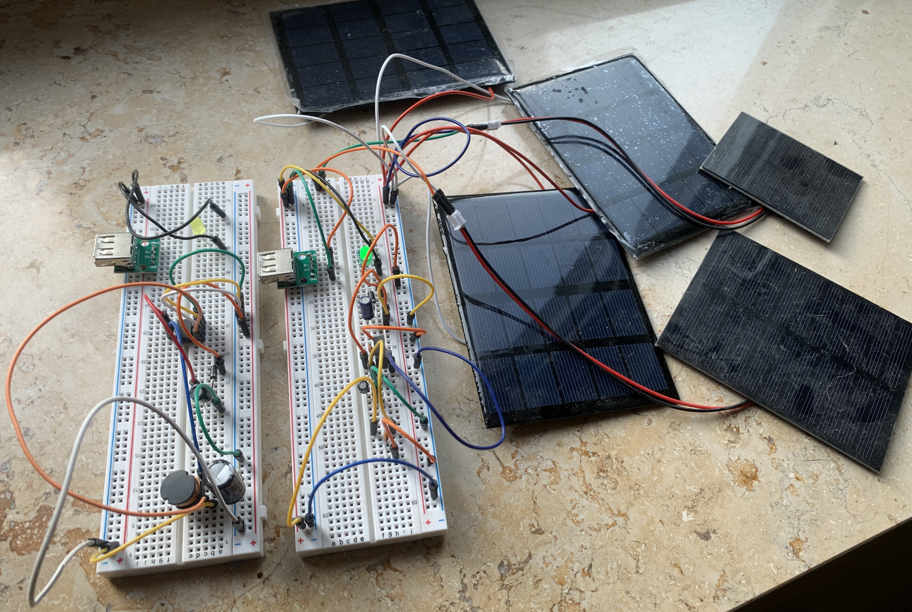

# Solar-Handylader
Solar-Handylader mit USB-Anschluss in 2 Versionen, eine mit linearem Spannungsregler und eine mit Schaltregler (Step-Down-Converter).  
Ziel ist es, mit vielen eingangsseitig verschalteten Solarzellen eine konstante Ausgangsspannung von 5V bei ausreichendem Strom zum Laden eines Handys oder Tablets über ein USB-Kabel bereitzustellen.  
Als linearer Spannungsregler wird ein 7805CT verwendet und als Schaltregler / Step-Down-Converter ein LM2574N-5. Die Kondensatoren, Induktivitäten und (Zener-)Dioden wurden gemäß den Datasheets der ICs ausgewählt und dimensioniert.

Mit diesem Projekt will ich üben, ICs zu verwenden und mit passiver Elektronik auszustatten, mit Messgeräten umzugehen und USB zur Spannungsversorgung/Energieübertragung einzusetzen. Die Schaltung an sich ist eine tolle Grundlage, um in Zukunft vielleicht ein Projekt drum herum zu bauen: z.B. einen Solarlader, der der Sonne folgt oder ein Ladegerät für Lithium-Ionen-Akkus. Die Spannungsregler-Schaltungen an sich können natürlich in mehr Projekten eingesetzt werden, bei denen stabile 5V bereitgestellt werden müssen, z.B. aus einer 9V-Batterie, ...  
Sobald die Schaltungen halbwegs fertig sind, können sie auf eine Leiterplatte gelötet oder als PCBs erstellt und in Auftrag gegeben werden. Inspiration: [5V Regulator design tutorial - How it works, how to design PCB altium](https://youtu.be/d-j0onzzuNQ?si=P9ErR5rJm8of-E-f)

Bei dem Projekt gibt es ein paar Herausforderungen und Weiterentwicklungsmöglichkeiten:
- Die Leistung, die die Solarzellen liefern, reicht noch nicht ganz aus. Bei Tageslicht und Parallelschaltung einiger Zellen reicht die Ladeleistung gerade so, um ein älteres Samsung-Tablet langsam zu laden. Für mein iPhone XS reicht es noch nicht und der Step-Down-Converter hat Probleme und liefert ausgangsseitig eine zu niedrige Spannung. Deshalb müssen noch mehr Solarzellen eingebaut werden. Es könnten z.B. Stacks von Solarzellen in Reihe geschalten werden und mit anderen Stacks ungefähr gleicher Spannung ([Ausgleichströme!](https://de.wikipedia.org/wiki/Spannungsquelle#Parallelschaltung)) parallel geschalten werden, um einen höheren Ladestrom bei gleichzeitig stabil über 5V am Eingang zu erreichen.
- Man könnte den Lader noch intelligenter gestalten: Ein Arduino bzw. Microcontroller IC könnte die Spannungen überwachen und das Laden abschalten, wenn die Solarpanels verschattet sind
- Man könnte einen Lithium-Ionen-Akku oder ähnliches als Pufferspeicher dazwischenschalten. Dieser wird von der Schaltung geladen und liefert selbst immer eine stabile Spannung bei ausreichend Ladeleistung. Dafür wäre wahrscheinlich ein entsprechender Lade-IC zusätzlich nötig, der wiederum irgendeine Art von Stromversorgung bräuchte.

## Bilder:

